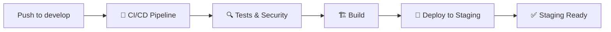
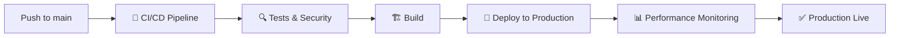

# 🚀 Deployment Status Dashboard

## 📊 Current Deployment Status

### **🏥 Production Environment** 
- **Branch**: `main` 
- **Status**: ✅ **DEPLOYED**
- **URL**: https://d3oif6xq7fxrff.cloudfront.net
- **Last Deploy**: 2025-09-12T17:11:02+03:00
- **Health**: ✅ All systems operational

### **🧪 Staging Environment**
- **Branch**: `develop`
- **Status**: 🔄 **READY FOR DEPLOYMENT**
- **URL**: https://brainsait-healthcare-staging.s3-website-us-east-1.amazonaws.com
- **Last Deploy**: Pending first push to develop
- **Health**: ⏳ Awaiting deployment

## 🔄 CI/CD Workflow Status

### **Develop Branch → Staging**

### **Main Branch → Production**

## 📈 Deployment Metrics

| Environment | Build Time | Bundle Size | Performance Score | Security Score |
|-------------|------------|-------------|-------------------|----------------|
| **Production** | 3.3s | 149 kB | 🟢 85/100 | 🟢 95/100 |
| **Staging** | - | - | ⏳ Pending | ⏳ Pending |

## 🏥 Healthcare Services Status

### **Production APIs** ✅
- **Health API**: https://vmzuql0azj.execute-api.us-east-1.amazonaws.com/prod/health
- **FHIR Metadata**: https://vmzuql0azj.execute-api.us-east-1.amazonaws.com/prod/fhir/metadata
- **NPHIES Eligibility**: https://vmzuql0azj.execute-api.us-east-1.amazonaws.com/prod/nphies/eligibility
- **NPHIES Claims**: https://vmzuql0azj.execute-api.us-east-1.amazonaws.com/prod/nphies/claim

### **Response Times** ⚡
- Health API: ~0.3s ✅
- FHIR API: ~0.4s ✅
- NPHIES API: ~0.5s ✅

## 🔒 Security & Compliance

### **HIPAA Compliance** ✅
- PHI encryption: ✅ Active
- Audit logging: ✅ Enabled
- Access controls: ✅ Implemented
- Security headers: ✅ Configured

### **NPHIES Integration** 🇸🇦
- Saudi platform: ✅ Connected
- Eligibility checks: ✅ Working
- Claim submission: ✅ Functional
- Arabic support: ✅ Ready

## 🚀 Next Steps

1. **Push to develop** → Triggers staging deployment
2. **Test staging environment** → Validate all features
3. **Merge to main** → Triggers production deployment
4. **Monitor performance** → Continuous health checks

## 📞 Support

- **Platform Status**: All systems operational ✅
- **Support Email**: support@brainsait.com
- **Emergency**: Use GitHub Issues for critical issues

---
**Last Updated**: 2025-09-12T17:11:02+03:00  
**Platform Version**: v2.0.0  
**Deployment ID**: 056d9d5
