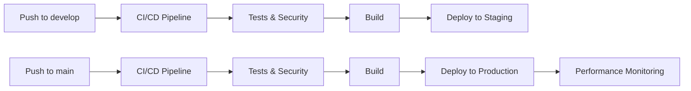

# 🔄 GitHub Workflows

## 📊 Workflow Status

[](https://github.com/brainsait/healthcare-platform-unified/actions)
[](https://github.com/brainsait/healthcare-platform-unified/actions)
[](https://github.com/brainsait/healthcare-platform-unified/actions)
[](https://github.com/brainsait/healthcare-platform-unified/actions)

## 🚀 Automated Workflows

### 1. **CI/CD Pipeline** (`ci-cd.yml`)
- **Triggers**: Push to `main`/`develop`, Pull Requests
- **Jobs**:
  - 🧪 **Test & Lint**: ESLint, TypeScript checking, Jest tests
  - 🏗️ **Build**: Next.js production build with artifacts
  - 🚀 **Deploy Staging**: Auto-deploy to staging on `develop` branch
  - 🏥 **Deploy Production**: Auto-deploy to production on `main` branch
- **Features**:
  - AWS S3 deployment with CloudFront invalidation
  - Lambda function updates
  - Deployment validation

### 2. **Security Scanning** (`security.yml`)
- **Triggers**: Push, Pull Requests, Weekly schedule
- **Jobs**:
  - 🛡️ **Security Analysis**: CodeQL, Snyk, npm audit
  - 🏥 **HIPAA Compliance**: PHI detection, security headers validation
- **Features**:
  - Automated vulnerability scanning
  - Healthcare compliance checks
  - Security alerts and reporting

### 3. **Healthcare Tests** (`healthcare-tests.yml`)
- **Triggers**: Push, Pull Requests
- **Jobs**:
  - 🔬 **FHIR Validation**: FHIR R4 compliance testing
  - 🇸🇦 **NPHIES Integration**: Saudi platform integration tests
  - ♿ **Accessibility Tests**: WCAG compliance validation
- **Features**:
  - Healthcare-specific testing
  - FHIR endpoint validation
  - Accessibility compliance

### 4. **Performance Monitoring** (`performance.yml`)
- **Triggers**: Push to `main`, Every 6 hours
- **Jobs**:
  - 🔍 **Lighthouse Audit**: Performance, accessibility, SEO scores
  - 🚀 **API Performance**: Response time monitoring
  - 📦 **Bundle Analysis**: Bundle size optimization
- **Features**:
  - Continuous performance monitoring
  - API response time validation
  - Bundle size tracking

## 🔧 Configuration Files

### **Lighthouse Configuration** (`.lighthouserc.json`)
```json
{
  "ci": {
    "assert": {
      "assertions": {
        "categories:performance": ["error", {"minScore": 0.8}],
        "categories:accessibility": ["error", {"minScore": 0.9}],
        "categories:best-practices": ["error", {"minScore": 0.8}],
        "categories:seo": ["error", {"minScore": 0.8}]
      }
    }
  }
}
```

### **Dependabot Configuration** (`.github/dependabot.yml`)
- **NPM Dependencies**: Weekly updates on Mondays
- **GitHub Actions**: Monthly updates
- **Security**: Automatic security updates
- **Healthcare Labels**: Proper categorization

## 🔐 Required Secrets

Add these secrets to your GitHub repository:

```bash
# AWS Deployment
AWS_ACCESS_KEY_ID=your_aws_access_key
AWS_SECRET_ACCESS_KEY=your_aws_secret_key

# CloudFront Distribution IDs
STAGING_CLOUDFRONT_ID=your_staging_distribution_id

# Security Scanning
SNYK_TOKEN=your_snyk_token
```

## 📈 Performance Thresholds

| Metric | Threshold | Action |
|--------|-----------|--------|
| Health API | < 2.0s | ✅ Pass |
| FHIR API | < 2.0s | ✅ Pass |
| NPHIES API | < 3.0s | ✅ Pass |
| Lighthouse Performance | > 80 | ✅ Pass |
| Lighthouse Accessibility | > 90 | ✅ Pass |
| Bundle Size | < 10MB | ✅ Pass |

## 🏥 Healthcare Compliance

### **HIPAA Compliance Checks**
- ✅ PHI pattern detection in code
- ✅ Security headers validation
- ✅ Audit logging verification
- ✅ Encryption compliance

### **FHIR R4 Validation**
- ✅ CapabilityStatement validation
- ✅ Resource structure compliance
- ✅ Terminology validation
- ✅ Interoperability testing

### **NPHIES Integration**
- ✅ Saudi platform compliance
- ✅ Eligibility verification testing
- ✅ Claim submission validation
- ✅ Arabic language support

## 🚀 Deployment Flow



## 📊 Monitoring & Alerts

- **Performance**: Continuous Lighthouse audits
- **Security**: Weekly vulnerability scans
- **Healthcare**: FHIR/NPHIES compliance monitoring
- **Accessibility**: WCAG 2.1 AA compliance tracking

All workflows are optimized for healthcare applications with HIPAA compliance and Saudi market requirements.
